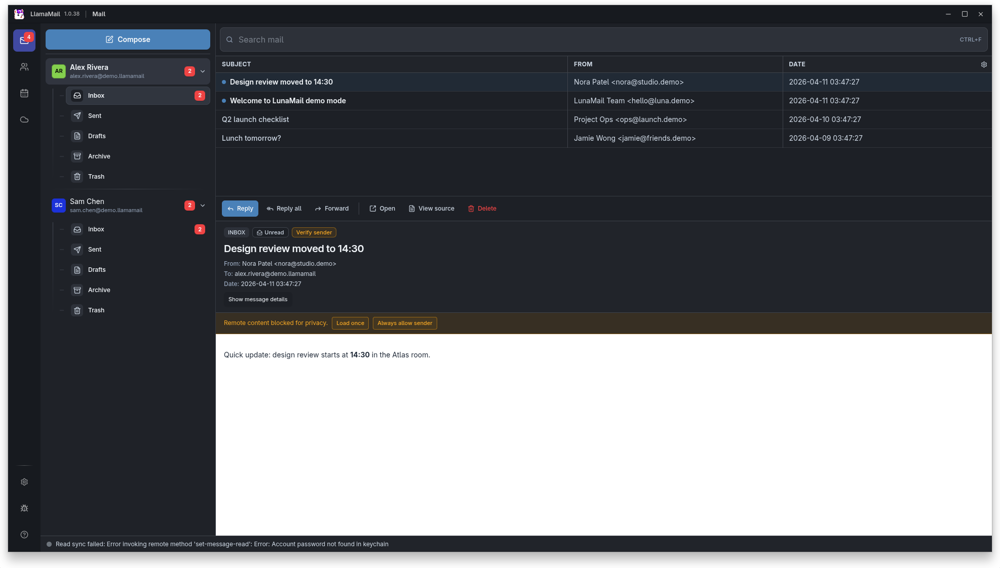
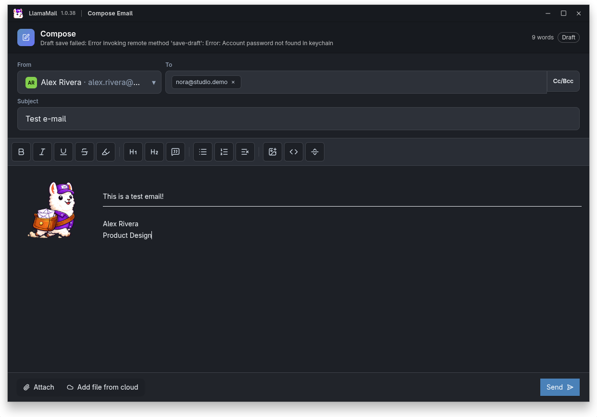

# LlamaMail

LlamaMail is a modern, offline-first desktop mail client built with Electron, React, TypeScript, Tailwind CSS, and SQLite (better-sqlite3 + Drizzle ORM).

## Screenshots




## Highlights

- Multi-account IMAP/SMTP support
- Fast local caching and offline-first message browsing
- Threaded message view and rich message reader
- Compose, reply, reply-all, forward, and attachments
- Optimistic actions: read/unread, flag, move, archive, delete
- Local search across folders and messages
- Contacts and calendar (DAV) integration
- Cloud provider integrations
- Developer diagnostics and debug console

## Tech Stack

- Electron
- React + TypeScript
- Tailwind CSS
- Vite
- Zustand
- TanStack Query
- SQLite (`better-sqlite3`)
- Drizzle ORM + drizzle-kit

## Requirements

- Node.js 20+
- npm 10+

## Getting Started

Install dependencies:

```bash
npm install
```

Run the app in development mode:

```bash
npm run dev
```

## Build

Build main, preload, and renderer:

```bash
npm run build
```

## Package

Linux:

```bash
npm run build:linux
```

Windows:

```bash
npm run build:win
```

macOS:

```bash
npm run build:mac
```

Additional packaging notes are in [docs/PACKAGING.md](./docs/PACKAGING.md).

## Quality Checks

```bash
npm run check:architecture
npm run test:unit
npm run build
```

## Project Layout

```text
src/
  main/
  preload/
  renderer/
    entrypoints/
    components/
    features/
    hooks/
    layouts/
    lib/
    pages/
```

For architecture and agent conventions, see [AGENTS.md](./AGENTS.md).

## License

ISC. See [LICENSE](./LICENSE).
